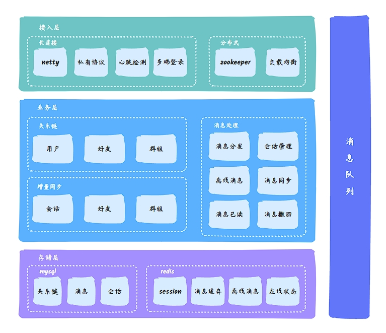
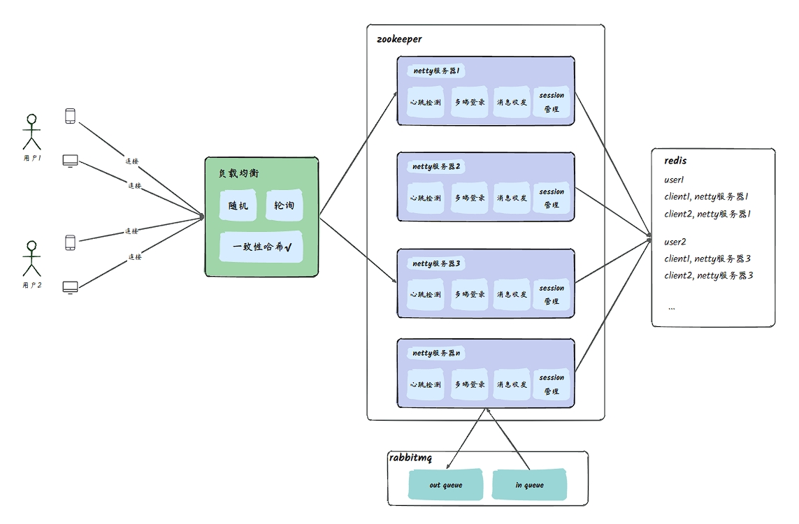
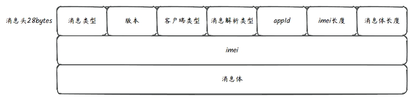
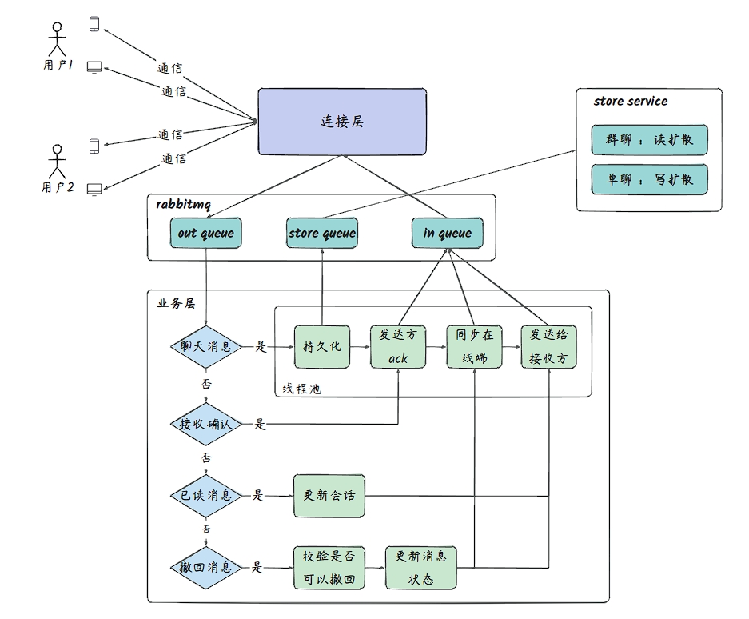
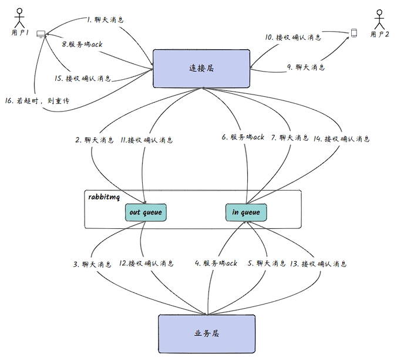
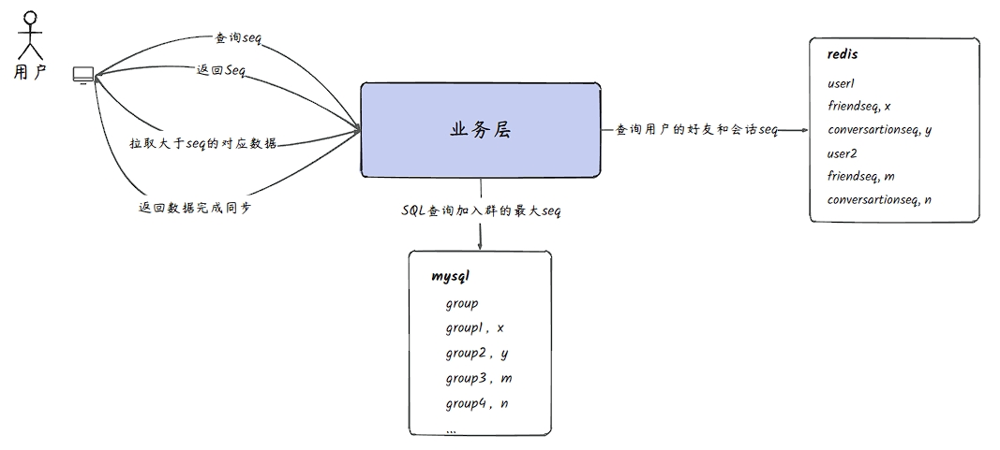

# 项目简介
> 本项目是基于netty与springboot3的即时通讯系统。使用netty实现长连接的管理和与客户端的双向通信。
使用zookeeper管理多个netty服务器节点，使用一致性哈希实现负载均衡。 业务层基于springboot3，主要完成关系链和消息的处理与分发。
连接层与业务层的通信使用rabbitmq。

  | 依赖         | 版本            |
  |------------|---------------|
  | JDK        | 17.0.9        |
  | SpringBoot | 3.1.6         |
  | Netty      | 4.1.100.Final |
  | RabbitMQ   | 3.9.11        |
  | Redis      | 7.2.3         |
  | MySQL      | 8.0.35        |
  | ZooKeeper  | 3.7.0         |

## 整体架构

## 连接层

- 连接层主要处理客户端与netty服务器的长连接，每个netty服务器使用map保存用户客户端与channel的映射，
便于后续消息的分发。
- 使用redis保存用户客户端与netty服务器的映射，便于业务层找到对应的netty服务器进行消息分发。 
- 使用一致性哈希进行负载均衡，key使用userid， 使同一用户的不同端设备处在同一netty服务器，简化消息分发，使得用户所有端设备的消息分发均由一个netty服务器完成。 
- 连接层收到客户端消息后投递到消息队列中，由业务层消费并进行处理。
- 连接层监听业务层的消息队列，收到消息后进行分发。

### 私有协议
使用私有协议解决tcp会产生半包、粘包问题，同时可以控制网络包的大小，减少不必要的数据传输，比较灵活且扩展性强。

## 消息收发

- 业务层监听连接层的队列，收到消息后根据消息类型的不同对消息进行处理与分发。 
- 收到聊天消息后，使用消息队列进行异步持久化，节省数据持久化的等待时间。
- 使用线程池并行处理消息，加快消息处理速度，提高消息实时性。

### 消息可靠性
使用双重ack，服务端收到消息之后回复一个ack，接收方收到消息之后再回复一个ack，确保消息可靠到达。

### 消息有序性
使用redis设置连续递增消息序号，对会话、群组消息设置连续序号，解决消息有序性问题。

### 消息幂等性
主要是解决消息重复，当发送方在超时时间后未收到接收方ack，将重新发送消息，此时服务端会重新生成序号等，
将消息重复持久化并发送给接收方，则接收方可能重复收到消息。 幂等性主要避免对重传消息进行序号生成与持久化，
保证接收方只收到收到一次消息。

解决方案：对收到的消息进行1分钟的缓存，如果发生重传，直接从缓存中拿出消息，不重新生成序号 与持久化。

### 消息已读
- 接收方已读后向发送方发送已读消息，由服务端做中转发送给接收方。
- 业务更新会话表中，会话表中包含已读的序号，表示已读到了哪条消息，可用于多端同步。

### 消息撤回
- 撤回方发送撤回消息。
- 服务端进行校验。
- 若符合撤回条件，服务端更新消息状态，并将撤回消息分发给撤回方其他在线端及接收方。

### 离线消息
- 使用redis的ZSet存储最近1000条离线消息。
- 避免离线用户登录时全量检索mysql数据库。
- 可以更具ZSet的排序特性，可以方便地实现分页拉取。

## 消息持久化
1. 单聊-写扩散 
   - 写成本增加不大，但是可以更高效的的查询消息（在增加消息所有者字段，在这个字段上添加索引） 。 
   - 消息拥有者字段适合分片

2. 群聊-读扩散
   - 少写成本，若是写扩散，则消息要写n份，当群聊人数过多时，造成写成本高，且占用空间大。 
   - 当读操作多时，容易产生io瓶颈。 
   - 优化点：读写结合，设置临界值，低于临界值时，使用写扩散，使写成本和空间占用可控；高于临界点时，使用读扩散。
3. 消息唯一主键：message_key，使用雪花算法生成。

## 增量数据同步
比较本地seq与服务端seq，若小于则拉取大于seq的部分。
可以拉取的包括关系链、会话、群组和离线消息。

